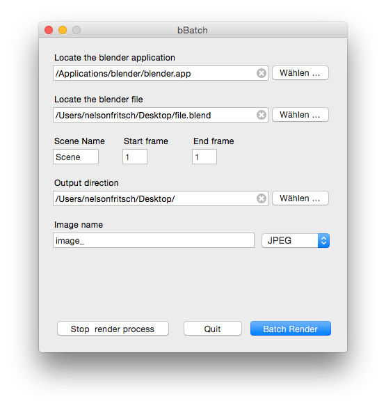

# bbatch

**About**

A GUI wrapper for faster rendering computation with Blender 3D via CLI for macOS.

This repository is unmaintained. 

**Dependencies**

bbatch relies on [Pashua](https://www.bluem.net/en/mac/pashua/) by [Carsten Blüm](https://github.com/BlueM), a CLI wrapper for macOS. 

- Download Pashua and place the main application into the **/Applications** folder

**Installation**

Put Pashua.app in the **/Applications** Folder or Desktop or keep it in the same folder as bBatch.

**Support**

bbatch runs on Mac OS 10.6 or higher.

**Further reading**

Command line execution is officially documented:

- https://docs.blender.org/manual/en/dev/render/workflows/command_line.html
- https://docs.blender.org/manual/en/dev/advanced/command_line/arguments.html
